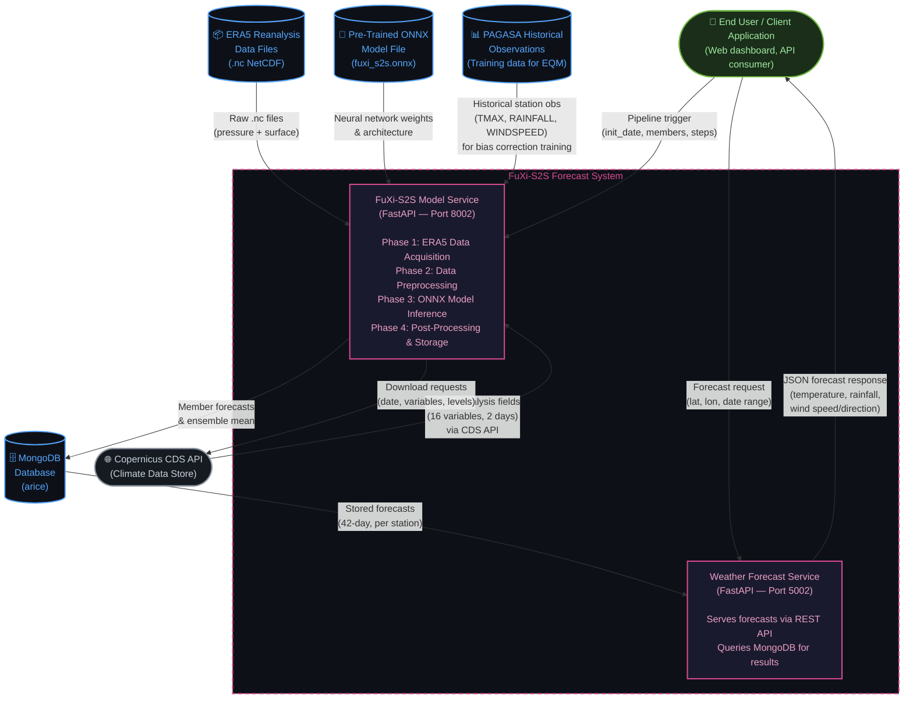
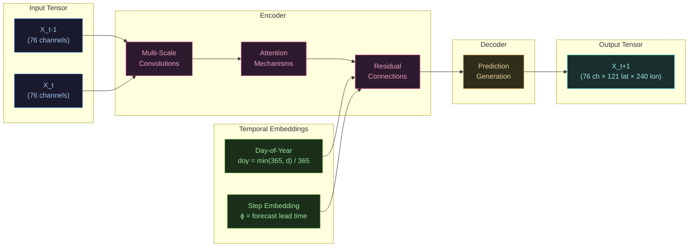
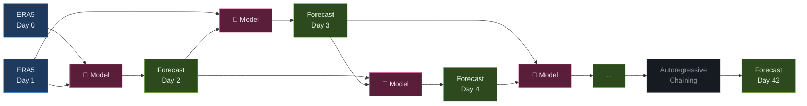
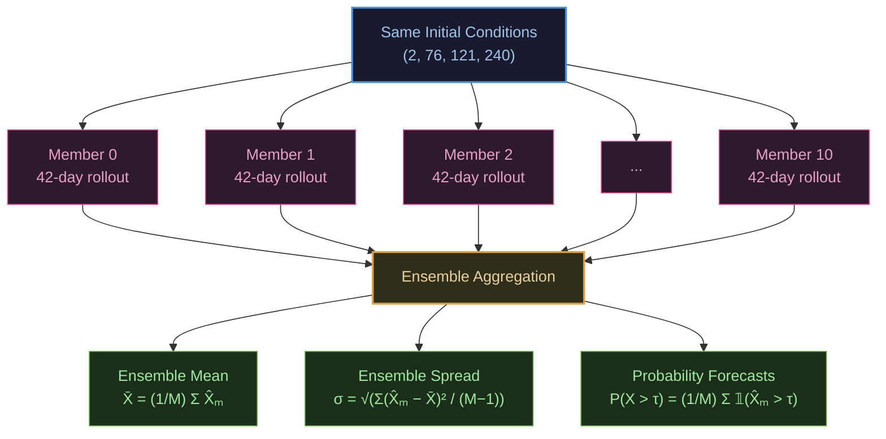
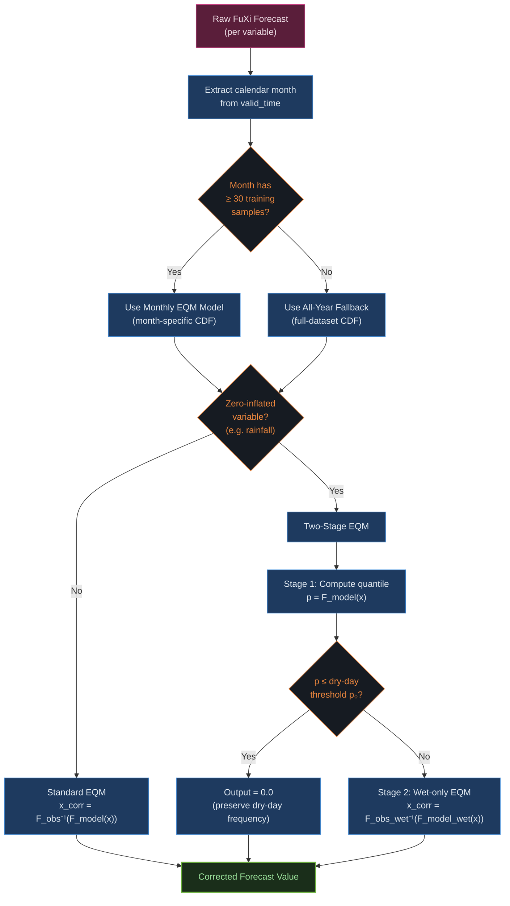
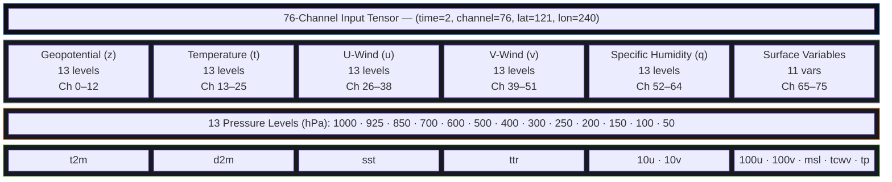

# FuXi-S2S Algorithm Flowchart

> System flowchart of the FuXi-S2S subseasonal-to-seasonal weather forecast algorithm.

---

## System Context Diagram

The context diagram shows the **FuXi-S2S system as a single process** and every external entity it interacts with. This is the highest-level view — it answers *"What goes in, what comes out, and who is involved?"* before diving into the internal phases.



### Context Diagram — Explanation

The context diagram identifies **six external entities** that surround the FuXi-S2S system and the **data flows** between them. Understanding this boundary is essential before examining the internal phases.

#### External Entities

| Entity | Type | Role |
|---|---|---|
| **Copernicus CDS API** | External Service | The data source for ERA5 reanalysis fields. The system sends download requests (specifying dates, variables, and pressure levels) and receives NetCDF files containing the global atmospheric state. |
| **ERA5 Reanalysis Data Files** | Data Store (files) | The raw `.nc` files stored locally after download. These contain 16 meteorological variables across 13 pressure levels and 2 consecutive days — the initial conditions the model needs. |
| **Pre-Trained ONNX Model File** | Data Store (file) | The neural network (`fuxi_s2s.onnx`) that encodes the learned atmospheric dynamics. It is loaded once per pipeline run and called 42 × 11 = 462 times (steps × members) to generate forecasts. The model is read-only — it is not retrained during inference. |
| **PAGASA Historical Observations** | Data Store (files) | Historical ground-station measurements from PAGASA (Philippine Atmospheric, Geophysical and Astronomical Services Administration). Used exclusively during bias correction training — paired with past FuXi forecasts to build the Empirical Quantile Mapping (EQM) curves. Not accessed during real-time inference unless the corrector is being retrained. |
| **MongoDB Database** | Data Store (database) | The persistence layer. The Model Service writes two collections: `fuxi_member_forecasts` (individual ensemble member outputs) and `fuxi_final_forecasts` (ensemble mean — the primary product). The Weather Service reads from these collections to serve forecasts. |
| **End User / Client Application** | External Actor | Any consumer of the forecast — a web dashboard, mobile app, or downstream API client. Users interact through two channels: triggering a pipeline run via the Model Service API (port 8002), or querying forecast results via the Weather Service API (port 5002). |

#### Two Internal Services

The FuXi-S2S system is composed of **two Docker microservices** on a shared bridge network:

1. **FuXi-S2S Model Service** (Port 8002) — The computational engine. It executes the full 4-phase pipeline: downloading ERA5 data, preprocessing it into a 76-channel tensor, running ONNX model inference with autoregressive rollout and ensemble generation, and storing results to MongoDB. It exposes API endpoints for triggering the pipeline (`POST /api/v1/pipeline/run`), running individual steps (download, inference, store), and checking job status.

2. **Weather Forecast Service** (Port 5002) — The read-only API layer. It serves pre-computed forecast results from MongoDB to end users. It supports queries by latitude/longitude coordinates and date ranges, returning JSON responses with temperature, rainfall, wind speed, wind direction, and other variables for up to 42 forecast days.

#### Data Flow Summary

```
                ┌──────────────┐
                │  CDS API     │──── ERA5 fields ────►┐
                └──────────────┘                       │
                                                       ▼
┌──────────────┐                         ┌─────────────────────────┐
│  ONNX Model  │──── weights ──────────► │                         │
└──────────────┘                         │   FuXi-S2S Model Svc    │
                                         │   (Download → Preprocess │
┌──────────────┐                         │    → Infer → Store)      │
│  PAGASA Obs  │──── training data ────► │                         │
└──────────────┘                         └──────────┬──────────────┘
                                                    │
                                            forecasts │
                                                    ▼
                                         ┌──────────────────┐
                                         │     MongoDB       │
                                         └────────┬─────────┘
                                                  │
                                           reads  │
                                                  ▼
                 ┌────────────┐          ┌──────────────────┐
                 │  End User  │◄── JSON ─┤ Weather Service   │
                 └────────────┘          └──────────────────┘
```

> **Key insight:** The two services have a clear separation of concerns. The Model Service is a **write-heavy, GPU-intensive** batch process that runs periodically (e.g. daily). The Weather Service is a **read-only, lightweight** API that serves cached results with sub-second latency. They communicate indirectly through MongoDB — there is no direct service-to-service call during normal operation.

---

## End-to-End Pipeline

```mermaid
flowchart TB
    START(["🚀 Start Pipeline"])

    subgraph PHASE1["Phase 1 — ERA5 Data Acquisition"]
        direction TB
        A1["Determine Target Init Date"]
        A2{"Init date\nprovided?"}
        A3["Use provided YYYYMMDD"]
        A4["Auto-select: UTC_now − lag_days"]
        A5["Compute 2 required dates:\ntarget − 1 day, target"]
        A6["Connect to Copernicus CDS API"]
        A7["Probe: Download geopotential.nc\nfor the 2-day window"]
        A8{"File contains 2\nconsecutive days?"}
        A9["Retry: offset += 1\n(up to max_lookback)"]
        A10["Download 5 pressure-level\nvariables × 13 levels"]
        A11["Download 11 surface\nvariables"]
        A12["Save init_date_used.txt"]
    end

    subgraph PHASE2["Phase 2 — Data Preprocessing (make_input)"]
        direction TB
        B1["Loop over 16 variable files\n(5 pressure + 11 surface)"]
        B2["Open NetCDF & normalize dims\nvalid_time→time, pressure_level→level\nlatitude→lat, longitude→lon"]
        B3{"Grid resolution\n721×1440?"}
        B4["Downsample: stride=6\n(0.25° → 1.5°)"]
        B5["Already 121×240\n(1.5° grid) — skip"]
        B6{"Variable-specific\ntransformations"}
        B7["tp: clip(val × 1000, 0, 1000)\nConvert m → mm"]
        B8["ttr: val / 3600\nConvert to hourly rate"]
        B9["Reorder pressure levels\n(1000 → 50 hPa descending)"]
        B10["Create channel labels\nPressure vars: e.g. z1000, t925\nSurface vars: e.g. t2m, tp"]
        B11["Concatenate all channels\n→ Tensor: (time=2, channel=76, lat=121, lon=240)"]
    end

    subgraph PHASE3["Phase 3 — Model Inference"]
        direction TB
        C1["Load ONNX Model\n(CUDA or CPU provider)"]
        C2["Load & validate input data\nAssert: lat 90°→−90°\nAssert: Δt = 1 day"]
        C3["Extract init_time from\nlast time coordinate"]
        C4{{"FOR member = 0\nTO total_member − 1"}}
        C5["Deep copy input batch\n(1, 2, 76, 121, 240)"]
        C6{{"FOR step = 0\nTO total_step − 1"}}
        C7["Prepare model inputs:\n• input: current state tensor"]
        C8{"Model uses\nstep embedding?"}
        C9["Add step = step index\n(forecast lead time encoding)"]
        C10{"Model uses\ndoy embedding?"}
        C11["Compute doy:\nmin(365, day_of_year) / 365\n(seasonal cycle encoding)"]
        C12["🧠 ONNX Forward Pass\nX_t+1 = F(X_t−1, X_t, ϕ, doy)"]
        C13["Update autoregressive state:\nnew_input ← output"]
        C14["Extract forecast:\noutput[:, −1:] → last time slice"]
        C15["Apply regional crop\n(lat/lon ± radius)"]
        C16["Save NetCDF file:\nmemberXX_leadYY.nc"]
        C17["lead_time += 1"]
        C18{{"Next step?"}}
        C19{{"Next member?"}}
    end

    subgraph PHASE4["Phase 4 — Post-Processing & Storage"]
        direction TB
        D1["Load forecast NetCDF files\nper ensemble member"]
        D2["Extract station-level values\n(nearest grid point to station lat/lon)"]
        D3["Unit conversions:\n• T: K → °C\n• Wind speed: √(u² + v²)\n• Wind direction: atan2(u,v)+180°"]
        D4["Compute ensemble statistics:\nmean, spread across M members"]
        D5{"Bias correction\nenabled?"}
        D6["Apply Monthly-Stratified EQM\n(Empirical Quantile Mapping)"]
        D7["Skip bias correction"]
        D8["Store member forecasts\n→ MongoDB: fuxi_member_forecasts"]
        D9["Store ensemble mean\n→ MongoDB: fuxi_final_forecasts"]
    end

    DONE(["✅ Pipeline Complete"])

    %% Main flow connections
    START --> A1
    A1 --> A2
    A2 -- "Yes" --> A3
    A2 -- "No" --> A4
    A3 --> A5
    A4 --> A5
    A5 --> A6
    A6 --> A7
    A7 --> A8
    A8 -- "No" --> A9
    A9 --> A7
    A8 -- "Yes" --> A10
    A10 --> A11
    A11 --> A12

    A12 --> B1
    B1 --> B2
    B2 --> B3
    B3 -- "Yes (0.25°)" --> B4
    B3 -- "No (1.5°)" --> B5
    B4 --> B6
    B5 --> B6
    B6 -- "tp" --> B7
    B6 -- "ttr" --> B8
    B6 -- "Others" --> B9
    B7 --> B9
    B8 --> B9
    B9 --> B10
    B10 --> B11

    B11 --> C1
    C1 --> C2
    C2 --> C3
    C3 --> C4
    C4 --> C5
    C5 --> C6
    C6 --> C7
    C7 --> C8
    C8 -- "Yes" --> C9
    C8 -- "No" --> C10
    C9 --> C10
    C10 -- "Yes" --> C11
    C10 -- "No" --> C12
    C11 --> C12
    C12 --> C13
    C13 --> C14
    C14 --> C15
    C15 --> C16
    C16 --> C17
    C17 --> C18
    C18 -- "Yes" --> C6
    C18 -- "No" --> C19
    C19 -- "Yes" --> C4
    C19 -- "No" --> D1

    D1 --> D2
    D2 --> D3
    D3 --> D4
    D4 --> D5
    D5 -- "Yes" --> D6
    D5 -- "No" --> D7
    D6 --> D8
    D7 --> D8
    D8 --> D9
    D9 --> DONE

    %% Styles
    classDef phase1 fill:#1e3a5f,stroke:#4a90d9,color:#e0e8f0
    classDef phase2 fill:#2d4a1e,stroke:#6db33f,color:#e0f0e0
    classDef phase3 fill:#5a1e3a,stroke:#d94a90,color:#f0e0e8
    classDef phase4 fill:#4a3a1e,stroke:#d9a04a,color:#f0e8e0
    classDef startEnd fill:#0d1117,stroke:#58a6ff,color:#58a6ff,stroke-width:2px
    classDef decision fill:#161b22,stroke:#f0883e,color:#f0883e

    class START,DONE startEnd
    class A2,A8,B3,B6,C8,C10,C18,C19,D5 decision
```



### Phase 1 — ERA5 Data Acquisition (Explained)

This phase is responsible for obtaining the **two consecutive days** of atmospheric reanalysis data that the model needs as initial conditions. The system connects to the **Copernicus Climate Data Store (CDS) API** and downloads ERA5 reanalysis fields.

**How it works step by step:**

1. **Date selection** — If the user supplies an initialization date (e.g. `20260510`), it is used directly. Otherwise, the system auto-selects by subtracting a configurable `lag_days` (default 5) from the current UTC date, because ERA5 data has a publication delay of roughly 5 days.
2. **Two-day window** — The model requires the atmospheric state at times *t−1* and *t*, so the system computes two dates: `target − 1 day` and `target`.
3. **Availability probe** — Before downloading all 16 variables, the system downloads only `geopotential.nc` first and checks whether the file actually contains 2 consecutive timesteps. If not (e.g. the latest day hasn't been published yet), it retries by stepping back one day at a time, up to `max_lookback` (default 14 days).
4. **Full download** — Once a valid 2-day window is confirmed, the remaining **4 pressure-level variables** (temperature, u-wind, v-wind, specific humidity) across **13 pressure levels** (1000–50 hPa) and **11 surface variables** (t2m, d2m, sst, ttr, 10u, 10v, 100u, 100v, msl, tcwv, tp) are downloaded as individual NetCDF files.
5. **Persistence** — The actual init date used is written to `init_date_used.txt` so downstream steps can reference it without re-parsing.

> **Source:** [download_era5.py](file:///c:/Machine%20Learning/FuXi-S2S/fuxis2s_model/core/download_era5.py)

---

### Phase 2 — Data Preprocessing / `make_input` (Explained)

This phase transforms the 16 individual raw ERA5 NetCDF files into a single, model-ready **76-channel tensor** with shape `(time=2, channel=76, lat=121, lon=240)`.

**How it works step by step:**

1. **Iterate over all 16 variables** — The system loops through 5 pressure-level variables (`z`, `t`, `u`, `v`, `q`) and 11 surface variables (`t2m`, `d2m`, `sst`, `ttr`, `10u`, `10v`, `100u`, `100v`, `msl`, `tcwv`, `tp`), loading each from its `.nc` file.
2. **Dimension normalization** — CDS-downloaded files use naming conventions like `valid_time`, `pressure_level`, `latitude`, `longitude`. These are renamed to the model's standard names: `time`, `level`, `lat`, `lon`.
3. **Regridding** — ERA5 native resolution is 0.25° (721 lat × 1440 lon). The model operates at 1.5° (121 × 240), so a stride-6 subsampling is applied. Files already at 1.5° are passed through unchanged.
4. **Variable-specific unit conversions:**
   - **Total precipitation (tp):** Multiplied by 1000 to convert from meters to millimeters, then clipped to [0, 1000] to remove negative artifacts.
   - **Top net thermal radiation (ttr):** Divided by 3600 to convert from accumulated Joules to an hourly rate.
   - **All other variables:** Used as-is from ERA5.
5. **Pressure level ordering** — Levels are reordered to descend from 1000 hPa (surface) to 50 hPa (stratosphere), matching the channel layout the model was trained on.
6. **Channel labeling** — Each pressure-level variable is expanded into 13 channels (e.g. `z1000`, `z925`, ..., `z50`). Surface variables become single channels (e.g. `t2m`, `tp`). This produces 5×13 + 11 = **76 channels** total.
7. **Concatenation** — All labeled channels are concatenated along the `channel` dimension, then transposed to `(time, channel, lat, lon)` — the final input tensor.

> **Source:** [data_util.py](file:///c:/Machine%20Learning/FuXi-S2S/fuxis2s_model/core/data_util.py)

---

### Phase 3 — Model Inference (Explained)

This is the core computational phase where the ONNX neural network generates the 42-day weather forecast through **autoregressive rollout** across **multiple ensemble members**.

**How it works step by step:**

1. **Model loading** — The pre-trained ONNX model file (`fuxi_s2s.onnx`) is loaded into an ONNX Runtime inference session configured for either CUDA (GPU) or CPU execution.
2. **Input validation** — The system asserts that latitudes run from 90°N to 90°S and that the two time steps are exactly 1 day apart.
3. **Outer loop: ensemble members** — The same initial conditions are used for each of the *M* members (default 11). Each member produces an independent 42-day trajectory. The neural network has inherent stochasticity (via dropout or similar mechanisms during inference) that causes members to diverge, sampling the space of possible weather evolutions.
4. **Inner loop: autoregressive steps** — For each member, the model is called 42 times in sequence:
   - **Inputs assembled:** The current 2-day state tensor, plus optional **step embedding** (integer encoding of forecast lead time) and **day-of-year embedding** (normalized `min(365, d)/365` to encode seasonal context).
   - **Forward pass:** The ONNX model produces the atmospheric state one day ahead: `X(t+1) = F(X(t−1), X(t), step, doy)`.
   - **State update:** The output replaces the input for the next step — this is the autoregressive chaining. The model's output becomes the "previous 2 days" for the next call.
   - **Forecast extraction:** The last time slice of the output is extracted as the forecast for that lead time.
5. **Regional cropping** — The global 121×240 output is cropped to a regional bounding box (e.g. Philippines: 13.58°N ± 10°, 123.28°E ± 10°) to reduce file sizes.
6. **NetCDF saving** — Each step saves one file named `memberXX_leadYY.nc`, with metadata including `init_time`, `valid_time`, `lead_time`, and `member` number.

**Performance:** On an RTX 4050 GPU, each forward pass takes ~1.7 seconds. A complete 42-day forecast for one member takes ~71 seconds. The full 11-member ensemble takes ~13 minutes.

> **Source:** [inference.py](file:///c:/Machine%20Learning/FuXi-S2S/fuxis2s_model/core/inference.py)

---

### Phase 4 — Post-Processing & Storage (Explained)

This phase converts the raw gridded model output into station-level weather forecasts, applies optional calibration, and stores the results in MongoDB for downstream application access.

**How it works step by step:**

1. **Load forecast files** — For each ensemble member, all 42 lead-time NetCDF files are loaded and concatenated along a `lead_time` dimension.
2. **Station extraction** — The nearest grid point to the target station's latitude/longitude is selected (e.g. Pacol, Naga City at 13.66°N, 123.22°E). This reduces the spatial grid to a single point per lead time.
3. **Unit conversions & derived variables:**
   - **Temperature:** Kelvin → Celsius (`T_C = T_K − 273.15`)
   - **Wind speed:** Computed from 10m u/v components: `speed = √(u² + v²)` in m/s
   - **Wind direction:** Meteorological convention (direction wind comes *from*): `dir = atan2(u, v) × 180/π + 180°`
4. **Ensemble aggregation** — All *M* member forecasts are grouped by lead time, and the **ensemble mean** is computed for each variable. This mean is the primary "final forecast" product.
5. **Optional bias correction** — If enabled, the **Monthly-Stratified Empirical Quantile Mapping (EQM)** corrector is loaded from a pre-trained pickle file and applied. This adjusts the model's systematic biases by mapping its output distribution to the historical PAGASA observation distribution, stratified by calendar month. (See the Bias Correction diagram below for the full algorithm.)
6. **MongoDB storage:**
   - **Individual member forecasts** → `fuxi_member_forecasts` collection (one document per member × lead time).
   - **Ensemble mean forecast** → `fuxi_final_forecasts` collection (one document per lead time).
   - Each document includes station metadata, run ID, timestamps, and all forecast variables.

> **Sources:** [store_forecasts.py](file:///c:/Machine%20Learning/FuXi-S2S/fuxis2s_model/core/store_forecasts.py) · [compare.py](file:///c:/Machine%20Learning/FuXi-S2S/fuxis2s_model/core/compare.py)

---

## Neural Network Architecture (Single Forward Pass)



### Neural Network Architecture (Explained)

The FuXi-S2S model is a deep neural network deployed as an ONNX file for portable, high-performance inference. Its architecture follows an **encoder–processor–decoder** design common in weather AI models.

**Components:**

- **Input layer** — Receives a tensor of shape `(batch, 2, 76, 121, 240)` representing 2 consecutive days of the global atmosphere across 76 variable-channels on a 1.5° lat/lon grid.
- **Encoder (Spatiotemporal Feature Extraction)** — Uses multi-scale convolutional layers to capture local spatial patterns (e.g. fronts, pressure gradients) at different resolutions. Attention mechanisms allow the network to model long-range teleconnections (e.g. the influence of tropical Pacific sea surface temperatures on mid-latitude weather). Residual connections ensure stable gradient flow during training.
- **Temporal processor** — Injects two auxiliary signals:
  - **Day-of-year embedding (`doy`):** A normalized scalar `min(365, d) / 365` that tells the model what season it is. This is critical because atmospheric dynamics differ drastically between monsoon and dry seasons.
  - **Step embedding (`ϕ`):** The current forecast lead time index (0–41). This allows the model to adjust its behavior for short-range vs. extended-range predictions, since error growth and predictability vary with lead time.
- **Decoder (Prediction Generation)** — Maps the encoded representation back to a `(batch, 2, 76, 121, 240)` tensor representing the atmospheric state one day forward.

**Key design insight:** Unlike numerical weather prediction (NWP) which solves differential equations, FuXi-S2S learns the atmospheric state transition function directly from decades of ERA5 reanalysis data. The temporal embeddings allow a single model to handle all forecast horizons without requiring separate models for different lead times.

---

## Autoregressive Rollout (42-Day Forecast)



### Autoregressive Rollout (Explained)

The model produces a **42-day forecast** by calling itself repeatedly — each call predicts one day ahead, and its output becomes the input for the next call. This is called **autoregressive** forecasting.

**Mechanism:**

1. **Step 1:** Feed the 2 real ERA5 days (Day 0, Day 1) into the model → produces Forecast Day 2.
2. **Step 2:** Feed (Day 1, Forecast Day 2) into the model → produces Forecast Day 3.
3. **Step 3:** Feed (Forecast Day 2, Forecast Day 3) → produces Forecast Day 4.
4. **Steps 4–42:** Continue chaining, always using the 2 most recent states as input.

**Important considerations:**

- **Error accumulation** — Because each prediction becomes the input for the next, errors compound over time. This is why ensemble members (which start identically but diverge) are important — they quantify forecast uncertainty.
- **No external forcing after initialization** — Unlike NWP models that ingest boundary conditions or observations at each step, FuXi-S2S is purely autoregressive from the initial 2 days. The only external information injected per step is the day-of-year and step embeddings.
- **The formula:** At step *k*, the prediction is `X̂(t+k) = F(X̂(t+k−2), X̂(t+k−1), k, doy(t+k−1))`. For the first 2 steps, `X̂` values are the actual ERA5 observations; after that, they are model predictions.

---

## Ensemble Forecast Generation



### Ensemble Forecast Generation (Explained)

Weather forecasting beyond ~10 days is inherently uncertain. Rather than producing a single deterministic forecast, FuXi-S2S generates an **ensemble** of 11 independent forecasts ("members") to capture the range of possible weather outcomes.

**How ensembles work in FuXi-S2S:**

- **Same initial conditions** — All 11 members start from the exact same 2-day ERA5 input tensor. There is no perturbation of initial conditions (unlike operational NWP ensembles).
- **Stochastic divergence** — The neural network's internal stochasticity (inherent in the model architecture's non-deterministic operations on GPU, or dropout-like mechanisms) causes each member's trajectory to diverge over time, especially at longer lead times.
- **Independent rollouts** — Each member performs its own 42-step autoregressive rollout independently.

**Ensemble statistics produced:**

| Statistic | Formula | Purpose |
|---|---|---|
| **Ensemble Mean** | `X̄ = (1/M) × Σ X̂ₘ` | Best-estimate forecast (smooths out unpredictable noise) |
| **Ensemble Spread** | `σ = √(Σ(X̂ₘ − X̄)² / (M−1))` | Quantifies forecast uncertainty (larger spread = less confidence) |
| **Probability Forecast** | `P(X > τ) = (1/M) × Σ 𝟙(X̂ₘ > τ)` | Fraction of members exceeding a threshold (e.g. probability of >50mm rain) |

**Why 11 members?** This is a balance between computational cost (~13 minutes total on GPU) and statistical robustness. Eleven members provide a reasonable sampling of the forecast distribution while keeping runtime practical for operational use.

---

## Bias Correction Sub-Algorithm (Monthly-Stratified EQM)



### Bias Correction — Monthly-Stratified EQM (Explained)

Machine learning weather models have **systematic biases** — they may consistently over-predict rainfall or under-predict temperature in certain seasons. The bias correction step calibrates FuXi-S2S output against historical PAGASA ground-station observations using **Empirical Quantile Mapping (EQM)**.

**Why monthly stratification?**

The Philippines has a pronounced monsoon cycle. A single all-year correction curve conflates the dry-season (Nov–Apr) and wet-season (May–Oct) distributions, producing a correction that is accurate for neither. By fitting separate quantile mappings for each calendar month, the correction adapts to intra-annual shifts in rainfall intensity, temperature range, and wind patterns.

**Algorithm (per variable):**

1. **Route by month** — The valid_time of each forecast row is used to determine its calendar month (1–12).
2. **Model selection:**
   - If the month has ≥ 30 paired training samples (forecast vs. observation), use the **month-specific EQM model**.
   - Otherwise, fall back to the **all-year EQM model** (fitted on the full training dataset).
3. **Standard EQM** (for non-zero-inflated variables like temperature, wind speed):
   - Compute the empirical CDF of model training values (`F_model`).
   - Compute the empirical CDF of observation training values (`F_obs`).
   - Map: `x_corrected = F_obs⁻¹(F_model(x))` — i.e., find what quantile the raw forecast sits at in the model distribution, then look up the corresponding value in the observation distribution.
4. **Two-stage EQM** (for zero-inflated variables like rainfall):
   - **Stage 1:** Compute the quantile rank `p = F_model(x)` of the raw forecast value.
   - **Decision:** If `p ≤ p₀` (where `p₀` = fraction of dry days in observations), output **0.0** — this preserves the observed dry-day frequency.
   - **Stage 2:** If `p > p₀`, apply EQM using only the **wet-day** sub-distributions: `x_corrected = F_obs_wet⁻¹(F_model_wet(x))`.

**Variables corrected:** `t2m_celsius` → PAGASA TMAX, `tp` → PAGASA RAINFALL (zero-inflated), `wind_speed` → PAGASA WINDSPEED.

> **Source:** [bias_correction.py](file:///c:/Machine%20Learning/FuXi-S2S/train_fuxi/bias_correction.py)

---

## Input Channel Organization (76 Channels)



### Input Channel Organization (Explained)

The model ingests the atmosphere as a single **76-channel tensor**, analogous to how an image classifier treats RGB channels but with 76 physical variables instead of 3 colors.

**Channel breakdown:**

| Channels | Variable | Description | Count |
|---|---|---|---|
| 0–12 | Geopotential (`z`) | Height of pressure surfaces — encodes large-scale atmospheric structure | 13 |
| 13–25 | Temperature (`t`) | Air temperature at each level — drives convection and radiative transfer | 13 |
| 26–38 | U-wind (`u`) | West-to-east wind component — captures jet streams, trade winds | 13 |
| 39–51 | V-wind (`v`) | South-to-north wind component — captures meridional flow, monsoons | 13 |
| 52–64 | Specific humidity (`q`) | Moisture content — critical for precipitation and tropical dynamics | 13 |
| 65 | 2m temperature (`t2m`) | Near-surface temperature — directly impacts human weather experience | 1 |
| 66 | 2m dewpoint (`d2m`) | Surface moisture indicator — used for humidity and heat index | 1 |
| 67 | Sea surface temp (`sst`) | Ocean temperature — major driver of tropical weather and ENSO | 1 |
| 68 | Thermal radiation (`ttr`) | Top-of-atmosphere energy budget — radiative balance | 1 |
| 69–70 | 10m wind (`10u`, `10v`) | Surface wind — used for wind speed/direction forecasts | 2 |
| 71–72 | 100m wind (`100u`, `100v`) | Wind energy-relevant height — boundary layer dynamics | 2 |
| 73 | Mean sea level pressure (`msl`) | Pressure field — locates highs, lows, typhoons | 1 |
| 74 | Column water vapour (`tcwv`) | Total atmospheric moisture — precipitation potential | 1 |
| 75 | Total precipitation (`tp`) | Accumulated rainfall — most impactful for agriculture and flooding | 1 |

**Pressure levels (13):** 1000, 925, 850, 700, 600, 500, 400, 300, 250, 200, 150, 100, 50 hPa — spanning from the surface boundary layer to the lower stratosphere.

**Spatial grid:** 121 latitude points (90°N to 90°S) × 240 longitude points (0° to 358.5°E) at **1.5° resolution** — a global grid covering the entire Earth.

---

## State Transition Formula

The core prediction at each step:

```
X̂(t+k) = F( X̂(t+k-2), X̂(t+k-1), k, min(365, d) / 365 )
```

where:
- **X** ∈ ℝ^(76 × 121 × 240) — atmospheric state tensor
- **F** — ONNX neural network (encoder–attention–decoder)
- **k** — step embedding (forecast lead time, 1–42 days)
- **doy** — normalized day-of-year (seasonal cycle encoding)
- Autoregressive: each prediction feeds into the next step

---

*Generated from the FuXi-S2S codebase — May 2026*
